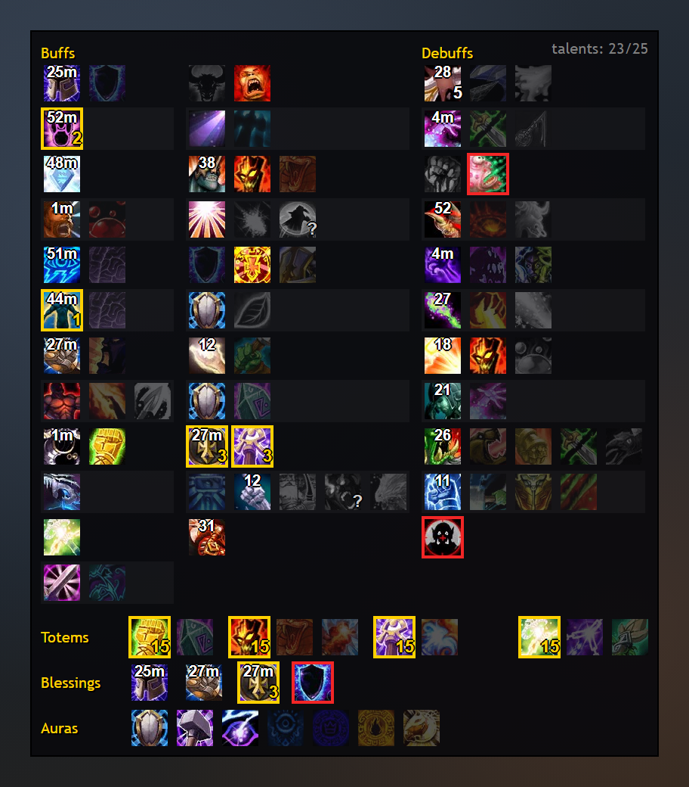

Tools for the raid leader: a checklist of every raid buff and debuff - who can bring it and whether it is up - 
marking a pack by pointing at it, and a reminder when a boss is pulled without master loot.

## Raid checklist

*Mockup of an ICC pull: Sunder Armor at 5 stacks, timers on the buffs and debuffs, Mark of the Wild missing
on 2 players (yellow), Hunter's Mark and Savage Combat possible but not up (red), talents still loading (?).*
Click the button to open the checklist. Every row is one raid effect (Attack Power, Bleed Damage, Spell Haste...),
and its icons are the classes and specs that can provide it. They do not stack, so one of them is enough.

| Icon | Means |
|---|---|
| colour | up, and on everyone who needs it |
| colour, **yellow** border | up, but some people lack it - the number says how many |
| colour, **red** border | not up, although someone in the raid can provide it |
| faded | another icon in the row already covers it |
| black and white | nobody in the raid can provide it |
| black and white, **?** | a player of that class is here, but their talents are not known yet |

- Debuffs only turn red in combat, with an enemy targeted.
- The number at the top of an icon is the time left; bottom right, the stacks of a debuff (Sunder Armor x5).
- **Hover** an icon for details: who has the buff, who is missing it, who can provide it.
- Hold **Ctrl** while hovering to see the game's own tooltip of the spell or talent.
- Below the rows: shaman totems, paladin blessings and paladin auras, each on its own.

Talents are read with LibGroupTalents: players running DBM share their talents automatically, the others are
inspected when they are close.

## Master loot reminder

When you lead the raid and a boss is pulled while the loot method is not **Master Looter**, a raid warning
shows on your screen with its sound: `Master loot is not set: Group Loot`. Only you see it, once per pull.
Turn it off in the options or with `/rlk loot`; `/rlk loottest` shows what it looks like.

## Marking a pack

Hold **left Ctrl + left Shift** and sweep the mouse over a pack: every enemy on your list is marked as it
passes under the cursor. Add them in the options by name or npc id, and give each one a mark of its own or
**A** for any mark no other rule asks for. An enemy that was just marked is left alone for ten seconds, so
going over the same pack again does not shuffle the marks around, and automatic marks never take a mark
away from an enemy that already has one.

`/rlk clearmarks` clears every raid mark, wherever it is - no need to have anything targeted.

## How to install

1. Download the addon: **[RaidLeadKit-master.zip](https://github.com/arkrosclou/RaidLeadKit/archive/refs/heads/master.zip)**.
2. Open the zip. Inside is a folder called `RaidLeadKit-master`. Copy it into your addons folder
   (`Interface/AddOns`) and **rename it to `RaidLeadKit`**. With the `-master` ending the game will not load it.
3. Start the game. At the character selection screen, click **AddOns** (bottom left) and make sure
   **RaidLeadKit** is enabled.

## How to update

Download the zip again and replace the `RaidLeadKit` folder with the new one. Your settings are kept: they
live in the `WTF` folder, not in the addon.

## Quick start

Left-click the button for the checklist, right-click for the options, drag it to move it.
Up to two keys can open the checklist too - set them in the options or in Esc > Key Bindings (two, so the
same key works in two keyboard layouts: `]` in English is `ї` in Ukrainian).
The options set the button and icon sizes, how many rows go in a column, and where the checklist opens.

| Command | What it does |
|---|---|
| `/rlk` | open the options |
| `/rlk toggle` | open / close the checklist (for a macro) |
| `/rlk minor` | show / hide the minor debuffs (cast speed, melee hit, healing, judgements) |
| `/rlk lock` | lock / unlock the button |
| `/rlk show`, `/rlk hide` | show / hide the button |
| `/rlk reset` | move the button back to the center |
| `/rlk loot` | turn the master loot reminder on / off |
| `/rlk loottest` | show the master loot reminder once |
| `/rlk clearmarks` | take every raid mark off |

## Problems

Found a bug or got a Lua error? Please [open an issue](https://github.com/arkrosclou/RaidLeadKit/issues).

## License

GPL v3, see [LICENSE](LICENSE). The bundled libraries in `Libs/` keep their own licenses and authors:
LibGroupTalents-1.0 (GPL v3), LibTalentQuery-1.0 (LGPL v2.1), LibStub and CallbackHandler-1.0 (public domain / BSD).
